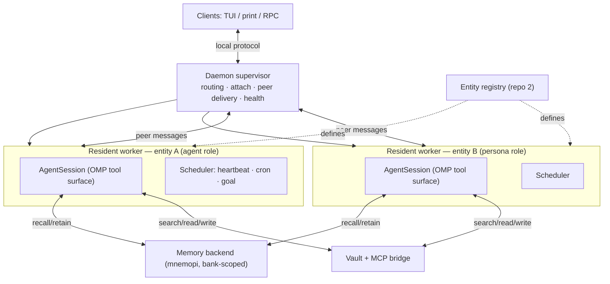

# Persistent Multi-Entity Agent System — Specification

> This is a design specification, not an implementation. It defines the system, its parts, the
> contracts between them, and a decomposition into parallel implementation workstreams. Rationale,
> alternatives considered, and the research trail live in `HANDOFF.md`; this document does not repeat them.

## 1. Goal and non-goals

### 1.1 Goal

A local-first system of **persistent, individually-configured AI entities** that:

- outlive a single terminal session (detach/reattach, survive terminal close);
- can be woken on a schedule, a heartbeat, or a durable goal, with no user attached;
- coordinate with one another directly (peer messaging), working independently or in concert as the task requires;
- each carry their own model, memory scope, tool grants, and optional local-vs-cloud hosting;
- share one human-browsable knowledge vault with per-entity and per-project sections;
- run on top of Oh My Pi (OMP), preserving OMP's native tool surface, skills, MCP, and ecosystem.

### 1.2 Non-goals (this version)

- Not a hosted/multi-user service. Single-user, single-machine (plus that user's own remote model endpoints).
- Not a security sandbox. Entities run with the user's OS permissions, same trust model as OMP/Prime Agent today.
- Not a governance/access-control layer. Shared-memory governance (an open industry problem per `HANDOFF.md`) is out of scope; single-user ownership sidesteps it.
- Not the ipython/RLM execution model. The daemon subsystem is ported; the single-tool Python surface is explicitly dropped in favor of OMP's discrete-tool model.

## 2. Terminology (operational definitions)

These are the precise definitions deferred from `HANDOFF.md`. They govern the rest of this spec.

- **Entity** — a named, persistent, individually-configured participant. Every entity has exactly one **role** and its own definition record in the registry (§5).
- **Role** — one of two policies an entity carries:
  - **agent** — generalist/coordinator policy. Broad remit. Retains **episodic** memory (conversation turns) across sessions. May delegate to and coordinate other entities. The roster may hold *many* agents; "agent" is a role class, not a singleton.
  - **persona** — specialist policy. Narrow domain. Retains only **curated domain lessons** across sessions (deliberate writes, not automatic per-turn capture). Does not accumulate raw episodic history.
- **Roster** — the set of all defined entities, discoverable and addressable at runtime.
- **Vault** — one shared knowledge store of human-browsable Markdown notes, partitioned into per-entity and per-project **sections** (§7). Backed by a hybrid retrieval layer (vector similarity + link graph).
- **Project pointer** — a thin stub committed inside a project repo that references (does not copy) the vault section owning that project's knowledge for a given entity (§7.3).
- **Runtime / daemon subsystem** — the supervisor + resident-worker + scheduler layer that gives entities persistence, scheduling, and peer messaging, ported from Prime Agent into OMP (§8).
- **Session** — one AgentSession as OMP defines it, now owned by a resident worker rather than a terminal client.

## 3. System architecture



The supervisor owns routing/attachment/peer-delivery/health only — never providers, tools, compaction, or scheduling execution (that lives in workers). This boundary is inherited from Prime Agent's proven design (`daemon.md`) and is what makes the port tractable without dragging in the RLM/ipython model.

## 4. Core concepts

### 4.1 Entity model

Each entity is a registry record (§5) resolved at worker launch into a running AgentSession. Fields:

- `name` (unique, stable), `role` (`agent` | `persona`)
- `model` (selector or role alias; per-entity, may target a local endpoint — §9)
- `effort`/`thinking` level
- `systemPrompt` (identity/voice/remit)
- `tools` (grant list from OMP's built-in + MCP tool surface)
- `memory` (bank binding — §6)
- `vaultSection` (owned vault path — §7)
- `autoloadSkills`, optional `WATCHDOG` advisor entry

Role determines **memory retention policy**, not capability ceiling: an agent auto-retains episodic turns; a persona only writes curated lessons on deliberate calls.

### 4.2 Memory model (three layers)

Layered per `HANDOFF.md` findings; industry-standard episodic-vs-semantic split.

1. **Episodic (agent-tier).** `memory.backend: mnemopi`, per-entity bank via `BankManager`. Auto-recall on session start, auto-retain per N turns. Agents only.
2. **Domain-lesson (persona-tier).** Curated, deliberate writes. Mechanism: OMP managed skills (`learn` tool `skill` param → `~/.omp/agent/managed-skills/<persona>/SKILL.md`) and/or a mnemopi bank the persona retains to only on explicit calls. No automatic episodic capture.
3. **Project (both roles).** Knowledge scoped to one repo, stored in the vault's project section, surfaced into the project via a pointer (§7.3).

Multi-bank concurrency (the gap identified in `HANDOFF.md`) is resolved by a **bank-scoped memory MCP server** (WS3) exposing `recall(bank, query)` / `retain(bank, memory)` so one running context can address multiple banks — required because OMP natively binds one `memory.backend` per session.

### 4.3 Vault

One store, human-browsable Markdown, partitioned:

```
vault/
  agents/<name>/       # per-agent notes
  personas/<name>/     # per-persona domain notes
  projects/<project>/  # per-project knowledge, referenced by project pointers
```

Retrieval is hybrid (vector similarity + Obsidian link graph). See §7 for the bridge and §7.3 for the pointer mechanism.

### 4.4 Coordination

Entities address one another through a peer-messaging layer (ported `agent_message` semantics — §8): `auto` (steer if busy, deliver if idle), `steer`, `follow_up`. Delivery survives detach because targets are resident workers, not terminal clients. Entities may work solo or hand off; there is no fixed hierarchy.

### 4.5 Runtime

The daemon subsystem (§8) provides persistence, scheduling, and peer delivery. It wraps OMP's existing AgentSession unchanged; it does not alter OMP's tool model, skills, MCP, or memory subsystems.

## 5. Repos and layout

Per `HANDOFF.md` "Repo layout": split by artifact type / change cadence.

- **Repo 1 — core/harness.** The daemon-subsystem port (WS1), shared MCP servers (WS3/WS4), coordination glue. This is the code that becomes the OMP core-runtime PR.
- **Repo 2 — registry.** Entity definition records (§4.1) as lightweight YAML/Markdown. Full prompts loaded on demand, not all-at-once (context-cost discipline).
- **Vault.** Starts inside repo 2 with the embedding index gitignored (regenerable, model-tied, bloats history). Splits to its own repo only when size/attachments/sync-cadence demand it. Deferred decision, flagged in §10.
- **Project repos.** Stay thin — pointer stubs only (§7.3).

## 6. Cross-workstream contracts (defined up front)

Parallel workstreams MUST agree on these interfaces before implementation, so concurrent work does not collide. These are the seams.

- **C1 — Entity record schema.** The YAML/Markdown shape of a registry entry (§4.1 fields). Produced by WS2; consumed by WS1 (worker launch), WS3 (bank binding), WS4 (vault section), WS7 (CLI/TUI).
- **C2 — Memory MCP tool contract.** `recall(bank, query, k?) -> results[]`, `retain(bank, memory, context?) -> id`, `forget(bank, id)`. Produced by WS3; consumed by entity sessions.
- **C3 — Vault MCP tool contract.** `search_notes(section?, query, k?)`, `get_note(path)`, `write_note(path, content)`, `get_connections(path)`. Produced by WS4; consumed by entity sessions.
- **C4 — Daemon control protocol.** Commands: `spawn(entity)`, `attach(id)`, `detach(id)`, `list()`, `stop(id)`, `schedule(...)`, `goal(...)`, `heartbeat(...)`, `send(target, message, mode)`. Produced by WS1; consumed by WS5 (peer delivery) and WS7 (CLI/TUI).
- **C5 — Session artifact paths.** Where per-entity scheduled jobs, goal state, and transcripts live on disk (adapted to OMP's session schema, not Prime's). Produced by WS1; consumed by WS3/WS5.

## 7. Vault and MCP bridge (detail)

### 7.1 Retrieval
- **Vector:** Smart Connections (Obsidian community plugin) computes and stores embeddings locally, no cloud calls. An MCP wrapper exposes semantic search. Read path first (matches "consult the vault" access pattern).
- **Graph:** Obsidian wikilinks/backlinks are the link graph; `get_connections` walks them. Hybrid pattern (embed → entry node → traverse) per `HANDOFF.md`.

### 7.2 Write path
Plain `write`/`edit` on Markdown files works with zero plugins (vault is just files). Structured programmatic writes (surgical section patching) only if needed → Obsidian Local REST API + Second Brain MCP extension. Start without it.

### 7.3 Project pointer
Native OMP `@`-import. A project's `.omp/skills/<persona>-project/SKILL.md` is a stub whose body is `@~/vault/projects/<project>/<persona>.md`. Content lives once in the vault; the project repo carries only the pointer, resolved at read time.

**Resolution convention (`~/vault` symlink):** the vault may live anywhere (sibling checkout, external drive, synced folder). A per-machine symlink `~/vault → <actual vault location>` keeps every project's pointer stub machine-portable (all stubs reference `@~/vault/...`, unchanged across machines and checkouts). OMP resolves `~/` to home, so the stub resolves through the symlink. A **setup process** (§12.7, WS7) creates and validates this symlink — not a manual step.

## 8. Runtime — daemon subsystem port (detail; Q3 option (i))

Ported from Prime Agent (`daemon.md`, `architecture.md`, `long-running-agents.md`), adapted to OMP. The RLM/ipython model is NOT ported; workers run OMP's normal discrete-tool AgentSession.

### 8.1 Components
- **Supervisor** (detached process): owns public socket, client attach/detach, routing, peer-message delivery, worker health/recovery, command journal. Executes no providers/tools/kernels.
- **Resident worker** (one per entity root tree): owns one AgentSession, its scheduler, and descendants. Survives client detach. Monitors supervisor socket; can re-launch a replacement via atomic lease if it dies.
- **Catalog** (subprocess): saved-session/inactive scans, isolated so its failure doesn't hit live workers.

### 8.2 Scheduling
Per-worker scheduler. Jobs persisted per session (`session-artifacts/<id>/scheduled-jobs.json`, adapted to OMP paths — C5). Due ticks claimed-and-advanced before delivery (crash doesn't replay uncertain prompts); missed ticks coalesced. Surfaces: user heartbeat (recurring visible instruction), agent-created heartbeats (programmatic), one-time/cron schedules, persistent goals (durable objective across turns), bounded autonomous mode (turn/token/wall-clock limits + optional gates). All of these inject a normal prompt into the session queue — no kernel involvement (this is why dropping ipython costs nothing here).

### 8.3 Protocol
JSONL-framed local socket: versioned command envelopes, capability negotiation, generation-aware event cursors `{generation, sequence}`, reconnect-with-resume, attach snapshot + begin/chunk/end streaming, file-backed transcript cache above a size threshold. Idempotency: mutating commands keyed `clientId+commandId`, journaled before dispatch, uncertain results reported not replayed.

### 8.4 Session-schema adaptation
Prime's session entry types (`bashExecution`, `child_usage_attributed`, role naming) differ from OMP's. The port reads/writes OMP's session schema (`omp://session.md`); this is bounded data-shape adaptation (both are id/parentId JSONL trees), not a logic rewrite. Isolated in C5.

## 9. Per-entity model and hosting

Per-entity `model` selector (C1). Local endpoints (Ollama/vLLM/LM Studio via OpenAI-compatible base URL) registered as providers; cloud via normal OMP provider config. Routing (which entity/model) is cheap and CPU-bound; only inference for locally-hosted entities needs to sit near the GPU. No new mechanism — OMP per-agent-def `model` field already supports this.

## 10. Resolved items (were open; closed this session)

1. **Vault repo placement — start inside repo 2, embedding index gitignored.** Split to a standalone repo only when the vault gains binary attachments, exceeds a few hundred MB, or needs a sync cadence (Obsidian Sync/iCloud) separate from git. Splitting later is a move, not a rewrite.
2. **Vault backing — Obsidian + Smart Connections (confirmed).** Human-browsable/editable notes are wanted, not just a vector store. WS4 stands as specified (§7). Not mnemopi-only.
3. **First persona — Phi (OMP/pi expert), confirmed.** WS2 pilot target. Chosen partly because a persona expert in this exact stack accelerates later workstreams.
4. **Project-pointer resolution — `~/vault` symlink convention (§7.3), with a setup process owning it.** Stubs stay machine-portable; a bootstrap/setup step (WS7) creates and validates the symlink rather than leaving it manual.
5. **Local-hardware entity placement — fully deferred (post-spec).** Default heuristic recorded for later: narrow high-volume/privacy-sensitive personas are local-model candidates; the complex-reasoning coordinator agent stays cloud. No entity pinned to local now. Workstation is Apple M5 (local inference viable via Ollama/MLX) — noted for when this reopens.

No open items block WS dispatch. Item 5 is the only deferral and it is post-implementation, not a prerequisite.

## 11. Attribution

The daemon-subsystem design (§8) derives from Prime Agent (`PrimeIntellect-ai/prime-agent`, MIT — Copyright (c) 2025 Mario Zechner, Copyright (c) 2026 Prime Intellect). OMP is MIT (Copyright (c) 2025 Mario Zechner, Copyright (c) 2025-2026 Can Bölük); both share Mario Zechner's upstream `pi` root. MIT→MIT: preserve notices, ship a NOTICE/attribution file crediting Prime Agent for the ported subsystem. If upstreamed as an OMP PR, credit in the PR description and any ported source headers.

---

# 12. Implementation plan — parallel workstreams

Each workstream is independently assignable to a sub-agent. Every workstream sub-agent runs the loop: **draft → dedicated code reviewer → dedicated tester → iterate until the workstream's acceptance criteria pass.** After all workstreams complete, a **final integration stage** (§12.9) runs an Opus-level reviewer + tester over the whole solution.

Workstreams MUST honor the §6 contracts (C1–C5); those seams are frozen before parallel work starts. Sub-agents skip project-wide lint/build/test during their pass (run once at integration) and coordinate contract questions directly rather than serializing.

Model/effort notation: `model` = capability tier; `effort` = reasoning/thinking level.

### 12.1 WS1 — Daemon subsystem port (core)
- **Scope:** §8 in full — supervisor, resident worker, catalog, scheduler, protocol, session-schema adaptation. Becomes the OMP core-runtime PR.
- **Produces:** C4, C5. **Depends on:** nothing (foundational). **Blocks:** WS5, WS7 partial.
- **Model:** Opus-level. **Effort:** high. (Largest, most load-bearing, most cross-cutting; protocol + process lifecycle + crash recovery.)
- **Acceptance:** session survives terminal close and reattaches; scheduled/heartbeat/goal prompts fire while detached; crash recovery does not replay uncertain prompts; OMP tool surface unchanged inside workers.

### 12.2 WS2 — Entity registry + role model
- **Scope:** C1 schema, registry loader, role→retention-policy mapping, on-demand prompt loading, repo-2 layout.
- **Produces:** C1. **Depends on:** nothing. **Blocks:** WS1 (launch), WS3, WS4, WS7.
- **Model:** mid-tier (Sonnet-class). **Effort:** medium.
- **Acceptance:** an entity record resolves to a launchable session config; agent vs persona retention policy is enforced; adding an entity needs no code change.

### 12.3 WS3 — Bank-scoped memory MCP server
- **Scope:** wrap `@oh-my-pi/pi-mnemopi` `BankManager`; expose C2 tools; per-entity bank binding; episodic (agent) vs curated (persona) write policy.
- **Produces:** C2. **Depends on:** C1. **Blocks:** entity sessions' memory.
- **Model:** mid-tier. **Effort:** high (concurrency, bank isolation, retention policy correctness).
- **Acceptance:** two entities address distinct banks concurrently in one running context; persona banks receive only deliberate writes; recall returns scoped results.

### 12.4 WS4 — Vault + MCP bridge
- **Scope:** §7 — Smart Connections MCP integration (read/semantic), graph connections, C3 tools, vault section layout. Local REST API only if write-structured needed.
- **Produces:** C3. **Depends on:** C1 (section ownership). **Blocks:** nothing hard.
- **Model:** mid-tier. **Effort:** medium.
- **Acceptance:** semantic search returns block-level hits scoped to a section; connections traversal works; plain-file writes land in the right section; no cloud calls.

### 12.5 WS5 — Coordination / peer messaging
- **Scope:** §4.4 — `agent_message` equivalent over the daemon (C4): `auto`/`steer`/`follow_up`, delivery receipts, roster addressing, broadcast within roster.
- **Produces:** peer layer. **Depends on:** C4 (WS1). **Blocks:** multi-entity concert workflows.
- **Model:** mid-tier. **Effort:** high (delivery semantics, busy/idle steering, survives detach).
- **Acceptance:** entity A steers/queues to entity B while detached; receipts reflect delivered vs queued; broadcast reaches roster only.

### 12.6 WS6 — Project pointer + skills/context wiring
- **Scope:** §7.3 — pointer stub generation, `@`-import resolution (incl. sibling-checkout/symlink case), autoloadSkills wiring, project-section conventions.
- **Produces:** project-tier surfacing. **Depends on:** C1, C3. **Blocks:** nothing.
- **Model:** mid-tier. **Effort:** low-medium.
- **Acceptance:** a project stub (`@~/vault/projects/<project>/<persona>.md`) resolves to the correct vault section at read time through the `~/vault` symlink; no content duplicated into project repos; resolution holds regardless of where the vault physically lives.

### 12.7 WS7 — Config, CLI, TUI surface
- **Scope:** user-facing commands over C4 — spawn/attach/list/stop, `schedule`/`goal`/`heartbeat`, roster view, per-entity model/effort config. Integrate with OMP's existing TUI/Agent Hub where possible rather than a parallel UI.
- **Produces:** operator surface. **Depends on:** C1, C4. **Blocks:** nothing.
- **Model:** mid-tier. **Effort:** medium.
- **Acceptance:** every C4 command reachable from CLI; roster and schedules visible; entity config editable without hand-editing files.

### 12.7a WS7 — Setup / bootstrap (sub-scope of WS7)
- **Scope:** first-run/idempotent setup: create + validate the `~/vault` symlink (§7.3, resolved-item 4) pointing at the actual vault location; scaffold repo-2 registry layout and vault section dirs; register any configured local model endpoints (§9). Re-runnable safely.
- **Depends on:** C1. **Model:** mid-tier. **Effort:** low.
- **Acceptance:** fresh machine → one setup run yields a resolvable `~/vault`, a loadable registry, and working project-pointer resolution; re-running is a no-op, not a clobber.

### 12.8 Dependency ordering
Contract-only prerequisites, not full-build serialization:
- Freeze C1 (WS2) and C4 (WS1 interface) **first** — everything keys off them.
- WS3, WS4, WS5, WS6, WS7 then proceed in parallel once their consumed contracts are frozen (implementations need not be finished — sub-agents code against the contract and coordinate over IRC per delegation rules).

### 12.9 Final integration stage
After all workstreams pass their own loops:
- **Opus-level reviewer:** whole-solution review — contract adherence across seams, no capability dropped vs this spec, attribution present (§11), OMP tool surface genuinely unchanged, security/trust notes honored.
- **Opus-level tester:** end-to-end scenarios — spawn 2+ entities (mixed roles), detach, verify scheduled wake + peer handoff + scoped memory + vault read/write + project-pointer resolution, then reattach and confirm state continuity.
- Iterate on findings until the whole-solution acceptance passes.

## 13. Status

IMPLEMENTED v1.0 — landed in ~/Work/github/oh-my-pi/packages/coding-agent. All 7 workstreams (WS1–WS7 + WS7a) built, per-workstream reviewed+tested+fixed, then whole-solution integrated. Final Opus integration review verdict: **READY (ship)** — all three launch-seam findings (per-entity memory/vault MCP binding at spawn, systemPrompt→customSystemPrompt, autoloadSkills at launch) resolved and verified through the real spawn path. Ground truth: package typecheck 0 errors; 193 targeted + end-to-end tests pass. Contracts C1–C5 (see CONTRACTS.md) frozen and honored across seams. Attribution present (§11). OMP tool surface unchanged (additive graft; ipython/RLM dropped). One documented non-blocking caveat: project-pointer autoload requires spawning with `--cwd <project>` (WS7 supports it; graceful no-op otherwise). Not yet: full monorepo suite/lint (deferred to pre-PR), upstream PR submission, live-model end-to-end (model boundary faked in tests per §12.9 scope).

**Addendum — 2026-08-19 (post-implementation, first live run).** The first real end-to-end run under `oma` surfaced three defects the faked-model integration review missed, now fixed + verified (see HANDOFF.md → "LATEST — 2026-08-19"): (1) project `.omp/mcp.json` memory-MCP registry/bin misconfig; (2) SPEC §1.1 persistence was broken live — the broker reaped resident workers on client-disconnect idle-shutdown, and the `oma entity` CLI never closed its daemon socket (the "60–120s hang"); fixed and shipped in fork PR #1 (`fix/entity-daemon-persistence-cli` → `oma`); (3) vault semantic search had no index — built offline, using `all-MiniLM-L6-v2` (a corporate proxy blocks HF's `bge-micro-v2`). Live-verified: spawn 1.3s, detached broker ppid=1, `ps` 0.2s shows a worker surviving client exit; 28/0 targeted tests. **Known open gap:** a one-shot `oma entity prompt` to a *detached idle* worker enqueues but does not wake it (C4 prompt path vs scheduler injection); interactive `attach` and scheduler/heartbeat injection unaffected. So the §1.1 "outlive the terminal" guarantee now holds, but unattended one-shot `prompt` delivery is not yet complete — treat the prior "READY (ship)" as READY-with-this-caveat.
