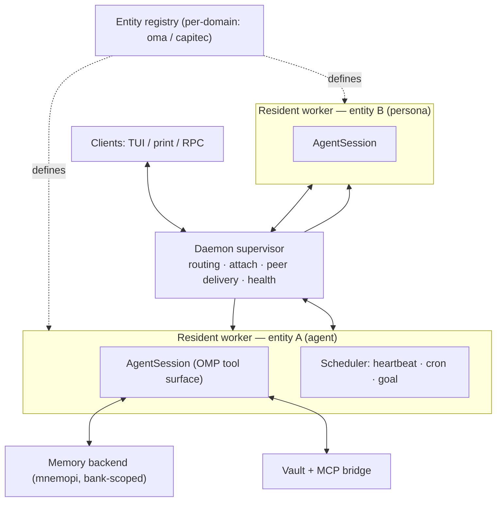

# Oh My Pi - Agent — Overview

> Confluence-bound page. Draft written from the OMA design corpus
> ([[personas/phi/oh-my-pi-agent/SPEC.md|SPEC]], [[personas/phi/oh-my-pi-agent/HANDOFF.md|HANDOFF]]).

## What OMA is

OMA (**O**h **M**y Pi - **A**gents) is a hackable model harness that provides local-first **persistent, AI entities that have built-in RAG generation and retrieval capabilties**. Built on top of [Oh My Pi (OMP)](https://github.com/can1357/oh-my-pi), with the persistent agent layer being inspired by(and borrowing heavily from) the iypthon-centric omp fork Prime Agent.

***Benefits over stock Claude:*** 

**Context-reuse effect:** Databricks found Pi sent ~3× less re-fed context per turn than Claude Code/Codex running the identical Opus 4.8 checkpoint, finishing in fewer turns at >2× lower cost for the same pass rate

**Gains in capability:** OMP's own 16-model benchmark reported Claude Sonnet 4.5 gaining +14.4 points from switching only the edit format (hashline vs. standard diff) — same model weights, same prompt intent, different edit mechanism

**Live debugging:** Adds LSP-verified refactors and real DAP debugging. Claude Code CLI and Cursor don't have this in the same form (Cursor has "Debug" tooling but not attached real debuggers via DAP; Claude Code has no built-in debugger integration)

**A roster of named, individually configured entities in one system:** Distinct
  model, memory bank, tool grants, and voice per entity. Address one directly
  with `@@<name>:`, or pull it in with the `@@` picker.  The first of these is Phi.

**Phi is a persona that ships with OMA** that provides tooling assistance while the user works. 
it has full awareness of the features and capabilities of OMA. So it teaches you how to use OMA as you work - allowing you to refine your workflow on the go.

**Durable agent sessions:** Where a normal coding-agent session lives and dies with one terminal, OMA runs a daemon so its entities outlive the terminal: you can detach, close the window, reattach later, and the entity is still there with its state intact. Entities can
also be woken on a schedule, a heartbeat, or a durable goal with nobody attached,
and they can message each other directly.

 **A shared, human-browsable knowledge vault with hybrid retrieval:** Plain
  Markdown you can open in Obsidian, git-diffable, with vector search over the
  same notes the wikilink graph connects. Not a hidden vector blob.

## Context

The OMA agent layer attempts to address one of the greatest challenges relating to ai-assisted development: context. OMA has various memory-related features to help in this regard: 

**A three-layer memory model.** OMA separates memory by *what* is remembered and
*who* remembers it:

- **Episodic (agent tier)** — conversation turns captured automatically. Agents
  auto-recall relevant history on start and auto-retain every few turns, so a
  coordinator picks up where it left off. Personas do not keep episodic memory.
- **Domain lessons (persona tier)** — deliberate, curated writes only. A persona
  records a durable lesson either as a managed skill (a `SKILL.md` under
  `~/.omp/agent/managed-skills/<persona>/`) or into its own memory bank, and only
  on an explicit call — never automatic per-turn capture.
- **Project (both roles)** — repo-scoped knowledge that lives once in the vault
  and is surfaced into the repo through **project pointers** (see below).

**Memory backends.** The storage mode is chosen per entity via `memory.backend`:

- `off` — no memory (default).
- `local` — project-scoped summaries/lessons distilled from session history;
  exposes only the `learn` tool.
- `hindsight` — remote, bank-scoped memory served by a Hindsight server.
- `mnemopi` — local SQLite long-term memory with bank scoping.

`hindsight` and `mnemopi` expose `recall` / `retain` / `reflect`; `mnemopi` adds
`memory_edit`. `local` is deliberately minimal (`learn` only).

**Memory banks and scoping.** In the `mnemopi` and `hindsight` backends the *bank*
is the unit of storage, and a **scoping mode** controls which bank an entity reads
and writes:

- `global` — one shared bank for everyone.
- `per-project` — an isolated bank per working directory (keyed by the directory
  basename plus a stable hash).
- `per-project-tagged` — writes land in the project bank, but recall spans both
  the project bank and the global bank.

**Project pointers.** Project-level knowledge is kept once, in the vault, at
`~/vault/projects/<project>/<persona>.md`. The repo itself carries only a stub at
`.omp/skills/<persona>-project/SKILL.md` whose body is a native OMP `@`-import
(`@~/vault/projects/<project>/<persona>.md`). The stub resolves at read time via
the `~/vault` symlink convention, so the same repo checkout stays portable across
machines while the content is never duplicated.

**Bank-scoped memory MCP server (WS3).** An MCP server wraps
the `BankManager` to expose `recall(bank, …)`, `retain(bank, …)`, and
`forget(bank, id)` against *named* banks. Because a session natively binds only
one `memory.backend`, this is what lets one running context address several banks
at once and enforces the episodic-vs-curated retention policies at a single layer.

Each entity carries its own model, memory scope, tool grants, system prompt, and
optional local-vs-cloud hosting. Two role policies exist:

- **agent** — generalist/coordinator. Broad remit, keeps **episodic** memory
  (conversation turns) across sessions, can delegate.
- **persona** — specialist. Narrow domain, keeps only **curated domain lessons**
  (deliberate writes, not automatic per-turn capture). The first persona is
  **Phi**, an OMP/pi expert.

All entities share one human-browsable Markdown **vault** (Obsidian) with
per-entity and per-project sections, backed by hybrid retrieval (vector
similarity plus the wikilink graph) giving you both context (the graph - links between sections IS your context and semantic search via vector embeddings.

OMA keeps OMP's native tool surface unchanged. It is an additive graft, not a
rewrite: the discrete-tool model (`read`/`edit`/`bash`/`task`/MCP/skills) is
exactly OMP's. It deliberately does **not** adopt Prime Agent's single-tool
Python/RLM kernel model.

## Why it was created

AI is changing the way we write code - the way we work, at a very fundamental level. As agentic capabilities grow we need to adapt our tooling and workflows to grow with it. That is the idea behind OMA - a harness that enables the user to reliably benefit from the advantages that AI provides while minimizing the 'slop' that occurs when AI is let loose without sufficient oversight and context. 

There are several angles to this: 
* **Entities** (domain specialists and agents with specific remits) providing context and guide-rails assisting users to give AI what it needs in order to function as they expect - this allows users to leverage the AI without having to spell out their intent as explicitly and exhaustively as the tooling requires. 
* **Project-level persistent memory** independent of a projects source-code - this allows the AI to maintain persistent context between sessions and between tasks - streamlining what you need to keep track of so you can focus on work instead of maintaining state for the AI
* **Registires that maintain entities, skills, as well as project knowledge**, allowing you to maintain separate biomes without risk of unwanted cross-pollination.
* **Context as variables** - The context window is one of the biggest limitations of modern day AI - only so much information can be passed through to a model at any given turn - when that context bloats the model loses track of what is important and capability drops sharply. To mitigate this, OMA takes a leaf out of Prime Agents book - context stored in variables outside the context and then injected as required - with a manifest preventing loss of state between compactions
* **Stateful agents** - A daemon called agentD manages state independent of the user session - this opens a lot of doors that I have not even begun to explore yet, at the moment the benefits are limited to keeping context between sessions where appropriate and allowing agents to interact with each other directly
* **Graph+Vector RAG** - The combination of graph and vector based knowledge retrieval means you get what you're looking for - even if you can't remember the exact phrasing in the information you are searching for - And links between information chunks give you and the AI sufficient context without drowning you in walls of text

## Architecture at a glance

The supervisor owns routing, attach/detach, peer delivery, and health only. It
runs no providers, tools, compaction, or scheduling execution — that all lives in
the workers. This is the boundary that made the port tractable.

## Where other harnesses are ahead

I want OMA to be genuinely good, so this section is deliberately not flattering.

- **Polish, reliability, and support.** Claude Code and Cursor are commercial
  products with large teams, hosted infra, and heavy QA. OMA is a small fork with
  interactive paths still verified by hand, not automated end-to-end. Several
  features are "verified live, not tested" today (see Roadmap / follow-up
  register).
- **IDE integration.** Cursor lives inside the editor with inline diffs, tab
  completion, and deep repo indexing. OMA is terminal-first.
- **OMP itself is broader and better maintained.** OMA is a thin layer on top of
  a fast-moving upstream. For anyone who does not need persistence or a
  multi-entity roster, stock OMP is simpler and gets every upstream fix
  immediately, without waiting for a rebase.
- **Prime Agent's daemon is more battle-hardened.** Prime has worker
  crash-recovery (retry backoff, replacement-supervisor election via lease,
  generation fencing of adopted workers) that OMA has not fully ported yet. Under
  crashes, Prime recovers more gracefully today.
- **Prime's continual-harness / refinement layer.** Versioned snapshot+rollback
  over an agent's own config (prompts, memories, skills, subagent specs). OMA
  leans on git for most of this and has no in-runtime rollback verb yet.
- **Ecosystem gravity.** Claude Code and Cursor have far more third-party skills,
  extensions, and community momentum. OMA inherits OMP's ecosystem but adds its
  own only slowly.
- **Setup cost.** OMA needs a daemon, a registry, and (for semantic
  search) a local embedding index. That is more moving parts than "install a CLI
  and go." In this environment a corporate proxy has already blocked the default
  HuggingFace embedding model, forcing a fallback — a real friction point.

## Comparison at a glance

| Capability                                          | OMA         | Stock OMP                  | Claude Code | Cursor     | Prime Agent               |
| --------------------------------------------------- | ----------- | -------------------------- | ----------- | ---------- | ------------------------- |
| Persistent agent sessions (survive terminal)        | ✅           | ❌                          | ❌           | ❌          | ✅                         |
| Scheduling / heartbeat / durable goal               | ✅           | ❌                          | ❌           | ❌          | ✅                         |
| Multi-entity roster (per-entity model/memory/voice) | ✅           | ❌ (subagents only)         | ❌           | ❌          | partial (subagents)       |
| Direct peer messaging surviving detach              | ✅           | ❌ (hub is live-only)       | ❌           | ❌          | ✅                         |
| Tiered scoped memory (episodic/curated/project)     | ✅           | mnemopi (one bank/session) | ❌           | repo index | durable state, no vectors |
| Human-browsable vault + hybrid retrieval            | ✅           | ❌                          | ❌           | ❌          | ❌                         |
| Native MCP as discrete tools                        | ✅ (via OMP) | ✅                          | ✅           | ✅          | ❌ (Python-wrapped)        |
| Markdown skills / marketplace                       | ✅ (via OMP) | ✅                          | ✅           | ✅          | ❌ (Python pkgs)           |
| IDE / inline-diff integration                       | ❌           | ❌                          | partial     | ✅          | ❌                         |
| Commercial polish / hosted reliability              | ❌           | ❌                          | ✅           | ✅          | ❌                         |
| Worker crash-recovery maturity                      | partial     | n/a                        | n/a         | n/a        | ✅                         |

## Links

- Design of record: [[personas/phi/oh-my-pi-agent/SPEC.md|SPEC]] ·
  [[personas/phi/oh-my-pi-agent/CONTRACTS.md|CONTRACTS]] ·
  [[personas/phi/oh-my-pi-agent/HANDOFF.md|HANDOFF]]
- Fork: [Predator404/oh-my-pi-agent](https://github.com/Predator404/oh-my-pi-agent)
- Upstream: [can1357/oh-my-pi](https://github.com/can1357/oh-my-pi)
- Companion pages: [[Roadmap]] · [[Changelog]]
