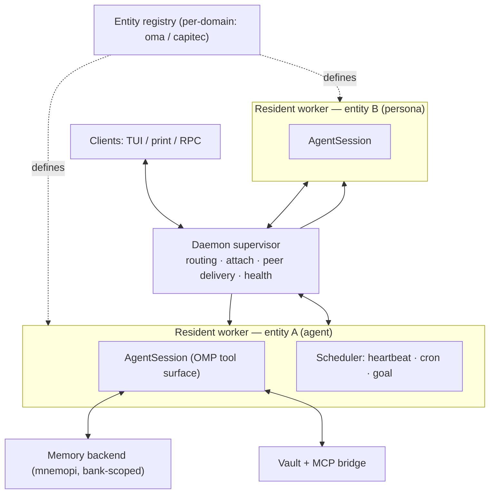

# Oh My Pi - Agent — Overview

> Confluence-bound page. Draft written from the OMA design corpus
> ([[personas/phi/oh-my-pi-agent/SPEC.md|SPEC]], [[personas/phi/oh-my-pi-agent/HANDOFF.md|HANDOFF]]).

## What OMA is

OMA (**O**h **M**y Pi — **A**gents) is a hackable, local-first model harness for **persistent AI entities with built-in RAG generation and retrieval**. It builds on [Oh My Pi (OMP)](https://github.com/can1357/oh-my-pi); the persistent-agent layer is inspired by — and borrows heavily from — the IPython-centric OMP fork Prime Agent.

***Benefits over stock Claude:*** 

**Context-reuse effect:** Databricks found Pi sent ~3× less re-fed context per turn than Claude Code/Codex running the identical Opus 4.8 checkpoint, finishing in fewer turns at >2× lower cost for the same pass rate

**Gains in capability:** OMP's own 16-model benchmark reported Claude Sonnet 4.5 gaining +14.4 points from switching only the edit format (hashline vs. standard diff) — same model weights, same prompt intent, different edit mechanism

**Live debugging:** Adds LSP-verified refactors and real DAP debugging. Claude Code CLI and Cursor don't have this in the same form (Cursor has "Debug" tooling but not attached real debuggers via DAP; Claude Code has no built-in debugger integration)

**A roster of named, individually configured entities in one system:** Distinct
  model, memory bank, tool grants, and voice per entity. Address one directly
  with `@@<name>:`, or pull it in with the `@@` picker. The first of these is Phi.

**Phi is a persona that ships with OMA** that assists while you work. Phi has
full awareness of OMA's features and capabilities, so it teaches you how to use
OMA as you go — letting you refine your workflow on the fly.

**Durable agent sessions:** Where a normal coding-agent session lives and dies with one terminal, OMA runs a daemon so its entities outlive the terminal: you can detach, close the window, reattach later, and the entity is still there with its state intact. Entities can
also be woken on a schedule, a heartbeat, or a durable goal with nobody attached,
and they can message each other directly.

**A shared, human-browsable knowledge vault with hybrid retrieval:** Plain
  Markdown you can open in Obsidian, git-diffable, with vector search over the
  same notes the wikilink graph connects. Not a hidden vector blob.

OMA keeps OMP's native tool surface unchanged — an additive graft, not a
rewrite. The discrete-tool model (`read`/`edit`/`bash`/`task`/MCP/skills) is
exactly OMP's; it deliberately does **not** adopt Prime Agent's single-tool
Python/RLM kernel model.

**Multiple workstreams:** A fork of T3-code already supports omp and oma concurrently. This brings the ability for the user to easily manage multiple workstreams simultaeously - this feature is still in early testing though.

## Memory & context

Context is one of the hardest problems in AI-assisted development: a model only
performs while the right information is in front of it. OMA's memory features
keep that context durable and scoped.

**A three-layer memory model** separates memory by *what* is remembered and
*who* remembers it:

- **Episodic (agent tier)** — conversation turns, captured automatically. Agents
  auto-recall relevant history on start and auto-retain every few turns, so a
  coordinator resumes where it left off. Personas keep no episodic memory.
- **Domain lessons (persona tier)** — deliberate, curated writes only. A persona
  records a durable lesson as a managed skill
  (`~/.omp/agent/managed-skills/<persona>/SKILL.md`) or into its own bank, always
  on an explicit call — never automatic per-turn capture.
- **Project (both roles)** — repo-scoped knowledge that lives once in the vault
  and surfaces into the repo through *project pointers* (below).

**Backends** are set per entity via `memory.backend`:

- `off` — no memory (default).
- `local` — project-scoped summaries distilled from session history; exposes only
  `learn`.
- `hindsight` — remote, bank-scoped memory served by a Hindsight server.
- `mnemopi` — local SQLite long-term memory with bank scoping.

`hindsight` and `mnemopi` expose `recall` / `retain` / `reflect`; `mnemopi` adds
`memory_edit`.

**Banks and scoping.** In `mnemopi` and `hindsight` the *bank* is the unit of
storage, and a scoping mode controls which bank an entity reads and writes:

- `global` — one shared bank.
- `per-project` — an isolated bank per working directory (keyed by basename plus
  a stable hash).
- `per-project-tagged` — writes land in the project bank; recall spans both the
  project and global banks.

**Project pointers.** Project knowledge lives once, in the vault, at
`~/vault/projects/<project>/<persona>.md`. The repo carries only a stub —
`.omp/skills/<persona>-project/SKILL.md` — whose body is a native OMP `@`-import
(`@~/vault/projects/<project>/<persona>.md`), resolved at read time through the
`~/vault` symlink. Content is never duplicated, and the checkout stays portable
across machines.

**Bank-scoped memory MCP server (WS3).** An MCP server wraps `BankManager` to
expose `recall(bank, …)`, `retain(bank, …)`, and `forget(bank, id)` against
*named* banks. A session natively binds only one `memory.backend`, so this is
what lets one running context address several banks at once, enforcing the
episodic-vs-curated retention policies in a single layer.

## Why it was created

AI is changing how we write code — how we work — at a fundamental level. As
agentic capabilities grow, our tooling and workflows have to grow with them.
That is the idea behind OMA: a harness that lets you reliably benefit from what
AI offers while minimizing the 'slop' that appears when AI is let loose without
enough oversight and context.

There are several angles to this:
- **Entities** — domain specialists and agents with specific remits that supply
  context and guard-rails, so you can leverage the AI without spelling your
  intent out as exhaustively as the raw tooling demands.
- **Project-level persistent memory** — independent of a project's source, so the
  AI keeps context across sessions and tasks. You focus on the work instead of
  re-establishing state for the AI each time.
- **Registries** that hold entities, skills, and project knowledge, keeping
  separate biomes without unwanted cross-pollination.
- **Context as variables** — the context window is one of AI's hardest limits:
  only so much fits per turn, and once it bloats the model loses track of what
  matters and capability drops sharply. Borrowing from Prime Agent, OMA stores
  context in variables outside the window and injects it on demand, with a
  manifest that preserves state across compactions.
- **Stateful agents** — a daemon (agentD) manages state independent of your
  session. Today that mainly means keeping context between sessions and letting
  agents talk to each other directly; the wider possibilities I've barely begun
  to explore.
- **Graph + vector RAG** — combining graph and vector retrieval finds what you're
  after even when you can't recall the exact phrasing, and the links between
  chunks give you and the AI enough context without drowning in walls of text.

## Architecture at a glance

The supervisor owns routing, attach/detach, peer delivery, and health. The workers 
run providers, tools, compaction, and scheduling execution.

## Where other harnesses are ahead

I want OMA to be genuinely good, so this section is deliberately not flattering.

- **Polish, reliability, and support.** Claude Code and Cursor are commercial
  products with large teams, hosted infra, and heavy QA. OMA is a small fork with
  interactive paths still verified by hand, not automated end-to-end. Several
  features are "verified live, not tested" today (see Roadmap / follow-up
  register).
- **IDE integration.** Cursor lives inside the editor with inline diffs, tab
  completion, and deep repo indexing. OMA is terminal-first with a move into T3 code already implemented on its own fork but yet to be tested.
- **OMP itself is broader and better maintained.** OMA is a thin layer on top of
  a fast-moving upstream. For anyone who does not need persistence or a
  multi-entity roster, stock OMP is simpler and gets every upstream fix
  immediately, without waiting for a rebase.
- **Prime Agent's daemon is more battle-hardened.** Prime has worker
  crash-recovery (retry backoff, replacement-supervisor election via lease,
  generation fencing of adopted workers) that OMA has not fully ported yet. Under
  crashes, Prime recovers more gracefully today.
- **Prime's continual-harness / refinement layer.** Versioned snapshot+rollback
  over an agent's own config (prompts, memories, skills, subagent specs). OMA
  leans on git for most of this and has no in-runtime rollback verb yet.
- **Ecosystem gravity.** Claude Code and Cursor have far more third-party skills,
  extensions, and community momentum. OMA inherits OMP's ecosystem but adds its
  own only slowly.
- **Setup cost.** OMA needs a daemon, a registry, and (for semantic
  search) a local embedding index. That is more moving parts than "install a CLI
  and go." In this environment a corporate proxy has already blocked the default
  HuggingFace embedding model, forcing a fallback — a real friction point.

## Comparison at a glance

| Capability                                          | OMA         | Stock OMP                  | Claude Code | Cursor     | Prime Agent               |
| --------------------------------------------------- | ----------- | -------------------------- | ----------- | ---------- | ------------------------- |
| Persistent agent sessions (survive terminal)        | ✅           | ❌                          | ❌           | ❌          | ✅                         |
| Scheduling / heartbeat / durable goal               | ✅           | ❌                          | ❌           | ❌          | ✅                         |
| Multi-entity roster (per-entity model/memory/voice) | ✅           | ❌ (subagents only)         | ❌           | ❌          | partial (subagents)       |
| Direct peer messaging surviving detach              | ✅           | ❌ (hub is live-only)       | ❌           | ❌          | ✅                         |
| Tiered scoped memory (episodic/curated/project)     | ✅           | mnemopi (one bank/session) | ❌           | repo index | durable state, no vectors |
| Human-browsable vault + hybrid retrieval            | ✅           | ❌                          | ❌           | ❌          | ❌                         |
| Native MCP as discrete tools                        | ✅ (via OMP) | ✅                          | ✅           | ✅          | ❌ (Python-wrapped)        |
| Markdown skills / marketplace                       | ✅ (via OMP) | ✅                          | ✅           | ✅          | ❌ (Python pkgs)           |
| IDE / inline-diff integration                       | ❌           | ❌                          | partial     | ✅          | ❌                         |
| Commercial polish / hosted reliability              | ❌           | ❌                          | ✅           | ✅          | ❌                         |
| Worker crash-recovery maturity                      | partial     | n/a                        | n/a         | n/a        | ✅                         |

